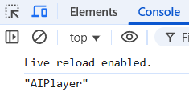

# sea-battle (морской бой)
Описание: 
В данном проекте реализовано консольное приложение "Морской бой" с использованием ООП парадигмы на языке JavaScript. 
Реализация проекта представлена пошагово: 
  - Шаг 1 (exercise01) - Проектирование корабля; 
  - Шаг 2 (exercise02) - Проектирование игрового поля; 
  - Шаг 3 (exercise03) - Проектирование игрока; 
  - Шаг 4 (exercise04) - Проектирование приложения; 
  - Шаг 5 (exercise05) - Проектирование игрока-человека; 
  - Шаг 6 (exercise06) - Проектирование игрока-искусственный интеллект; 
  - Шаг 7 (exercise07) - Партия игрок-человек против игрока-AI; 
  - Шаг 8 (exercise08) - Отображение информации о ходе игровой партии; 
  - Шаг 9 (exercise09) - Асинхронный режим игры; 
  - Шаг 10 (exercise10) - Партия игрок-AI против игрока-AI. 
Каждый новый модуль игры создается последовательно с использованием модулей, созданных на предыдущих шагах. 
Соответственно, финальная версия игры представлена в шаге 10 (exercise 10). 
**Проектирование корабля:   Input: "Ship" 5 1   Output: "Ship", 5, 1, false** 
 
**Проектирование игрового поля:   Input: 5   Output: 5, true** 
 
**Проектирование игрока:   Input: "Max 5"   Output: "Max" 5** 
 
**Проектирование приложения:** 
**первый игрок расставляет корабль размером (длиной) 3 на координаты 0,0 горизонтально, а второй игрок расставляет корабль размером 2 на координаты 3,1 вертикально. Первый ход за первым игроком, он атакует по координатам 3,1, далее второй игрок атакует по координатам 0,0, затем первый игрок атакует по координатам 3,2 и выигрывает партию.** 
 
**Проектирование игрока-человека:   Input: "Max"   Output: "Max"** 
 
**Проектирование игрока-искусственный интеллект:   Input: "AIPlayer"   Output: "AIPlayer"** 
 
**Партия игрок-человек против игрока-AI.** 
**Первый игрок-человек расставляет корабль размером 3 на координаты 0,0 горизонтально, второй игрок AIPlayer расставляет свой корабль автоматически. Игрок-человек делает хода (например 0,3), игрок AIPlayer делает ответный ход автоматически. Игра не закончится, пока кто-либо из игроков не потопит корабль противника** 
 
**Отображение информации о ходе игровой партии.** 
**Ход партии аналогичен партии игрок-человек против игрока-AI** 
 
**Асинхронный режим игры.** 
**Ход партии аналогичен партии игрок-человек против игрока-AI. При передаче ходе реализована задержка** 
 
**Партия игрок-AI против игрока-AI.** 
**Судный день!** 
<br /